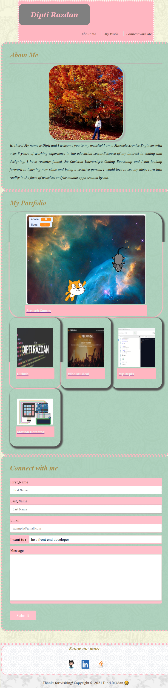

# My-Portfolio_Project

## Table of Contents
* [Introduction](#introduction)
* [Webpage Screenshot](#webpage)
* [Installations](#installations)
* [Assignment details](#details)
* [Credits](#credits)

 ## Introduction 
Updated Portfolio page, with my latest project added to it with all the other features remaining the same.
 
 ## Webpage Screenshot
 The screenshots here may not be accurate, but the site looks almost similar to the ones as shown here.
 
 
 __FOR LAPTOP DISPLAY__
 
 
 
 
  __FOR IPAD DISPLAY__
  
 
 
 
 __FOR SMALLER DISPLAYS__
 
 
  
 ## Installations
   * [The URL of the Github repo](https://github.com/Dipti2021/My-Portfolio_Project)
   * [The URL of the deployed application](https://dipti2021.github.io/My-Portfolio_Project/index.html)
 
 ## Assignment Details
 The following codes have been created  by me for the __HTML and the CSS files__ that were require for the portfolio:
 * __The .html file:__ 
    * Added a new div that contains the details and link to my first project.
    
  * __The .css file:__
    * Updated the flex so that 3 topics are displayed in 1 line and the fourth one is displayed in the next row
    
 
 ## Credits
    The homework has been assigned to me by the Carleton University Coding Bootcamp, our instructor and the TA's
   
     
